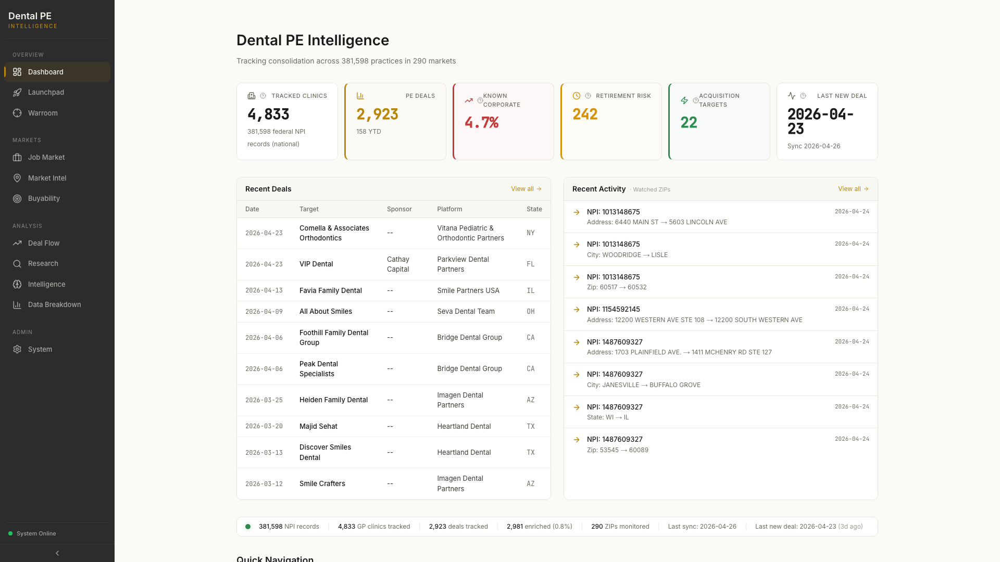
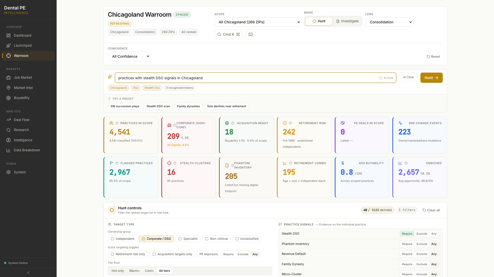
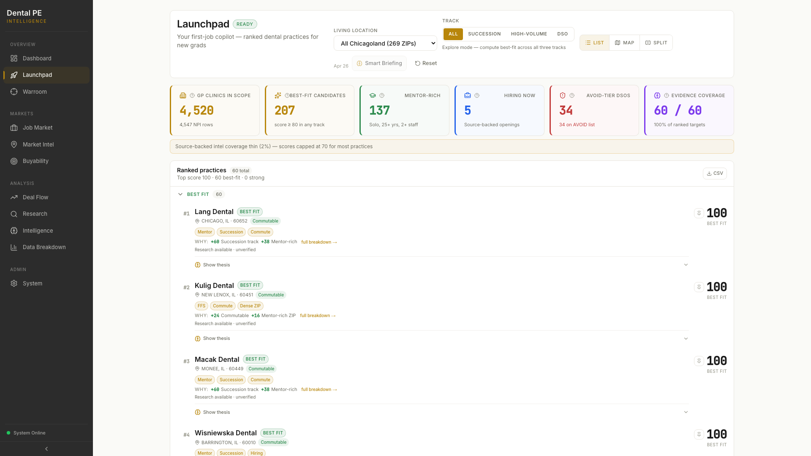
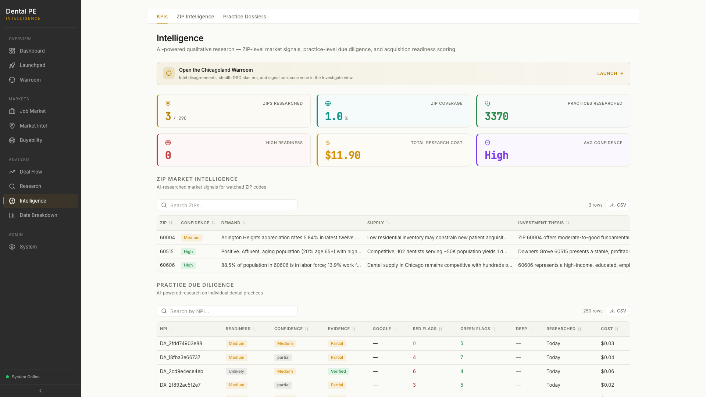

# Final QA Verification — 2026-04-26 23:01

Screenshots taken at 23:01 against https://dental-pe-nextjs.vercel.app (Playwright 1.59.1, Chromium 147, 1920×1080).

## Backend health snapshot (pre-screenshot, 22:48 resync)

| Table | Rows | Notes |
|---|---|---|
| practices | 13,818 | watched ZIPs only (Supabase) |
| practice_locations | 5,732 | address-deduped |
| practice_signals | 13,818 | stealth_dso_flag=95, last_change_90d_flag=263 |
| practice_intel | 3,370 | |
| deals | 2,923 | 158 from 2026, max date 2026-04-23 |
| practice_changes | 737 | watched ZIPs |
| zip_signals | 290 | |

## Per-page verdicts

### Home — PASS

- **KPIs (actual text):**
  - TRACKED CLINICS: **4,833** (subtitle: "381,598 federal NPI records (national)")
  - PE DEALS: **2,923** (subtitle: "158 YTD")
  - KNOWN CORPORATE: **4.7%**
  - RETIREMENT RISK: **242**
  - ACQUISITION TARGETS: **22**
  - LAST NEW DEAL: **2026-04-23**
- **Activity feed:** 8 entries visible, all dated **2026-04-24** — NPI moves (address, city, state, ZIP changes for 3 NPIs). NOT "No recent activity".
- **Recent Deals (top 3):**
  - 2026-04-23 — Comella & Associates Orthodontics → Vitana Pediatric & Orthodontic Partners (NY)
  - 2026-04-23 — VIP Dental → Parkview Dental Partners (FL)
  - 2026-04-13 — Favia Family Dental → Smile Partners USA (IL)
- **Freshness bar:** "Sync 2026-04-26" visible in footer.
- **Console errors:** 0
- **Screenshot:** 

### Warroom — PASS

- **Sitrep KPI strip (actual values):**
  - PRACTICES IN SCOPE: **4,541** (4,541 classified, 100.0%)
  - CORPORATE (HIGH-CONF): **209** (4.6%)
  - ACQUISITION READY: **18** (Buyability ≥ 50, 0.4% of scope)
  - RETIREMENT RISK: **242** (Pre-1995 · established independents)
  - PE DEALS IN SCOPE: **0** (Latest: --)
  - 90D CHANGE EVENTS: **223**
  - FLAGGED PRACTICES: **2,967** (65.3% of scope)
  - STEALTH CLUSTERS: **16** (95 practices)
  - PHANTOM INVENTORY: **205**
  - RETIREMENT COMBO: **195**
  - AVG BUYABILITY: **0.8 /100**
  - ENRICHED: **2,657** (58.5%, Avg opportunity: 98.8/100)
  - No zeros, no dashes, no "Loading…", no "Sitrep unavailable" banner.
- **Map:** Renders — WebGL GPU stall warnings in console (benign read-pixels performance notices from headless GPU, not errors). Consolidation choropleth + 27 target pins confirmed in body text: "269 ZIPs · 27 target pins".
- **Target list:** "40 / 5103 MATCHES" shown; 40 practices listed.
- **Signal overlay controls present:** Stealth DSO, Phantom Inventory, Revenue Default, Family Dynasty, Micro-Cluster, Retirement Combo, Recent Movement, High Peer Retirement — all 8 confirmed in DOM. Each has Require / Exclude / Any radio set.
- **Stealth DSO overlay click:** Clicked successfully. The intent bar auto-populated with "practices with stealth DSO signals in Chicagoland". Screenshot taken (`warroom-stealth-overlay.png`). The Sitrep card "STEALTH CLUSTERS: 16 / 95 practices" matches DB (stealth_dso_flag=95 rows across 16 clusters).
- **Market Briefing:** 6 auto-synthesized insights rendered (visible in body text), all with HIGH/MEDIUM confidence labels.
- **Console errors:** 0 (WebGL GPU stall = warning only, not error)
- **Screenshot:** 

### Launchpad — PASS

- **Practice cards:** 60 total ranked (body: "Ranked practices 60 total · Top score 100 · 60 best-fit · 0 strong"). Cards show scores, track badges (Mentor, Succession, Commute, FFS, Hiring), and WHY breakdowns with point values.
- **"Structural record only" count:** **0** — not a single instance in the DOM. Fix confirmed.
- **Intel coverage labels visible on cards:**
  - "Research available · unverified" — majority of cards (structural records with dossier data but not yet verification-gated)
  - "Source-backed intel · verified · 7 URLs" — e.g., #5 Mcgraw Dental
  - "Source-backed intel · partial · 4 URLs" — e.g., #6 DENNIS J DWYER DDS PC
  - "Source-backed intel · partial · 5 URLs" — e.g., #11 Advanced Family Dental, #15 (anon)
- **KPIs:** GP CLINICS IN SCOPE: 4,520 | BEST-FIT CANDIDATES: 207 | MENTOR-RICH: 137 | HIRING NOW: 5 | AVOID-TIER DSOS: 34 | EVIDENCE COVERAGE: 60/60 (100%)
- **Warning banner:** "Source-backed intel coverage thin (2%) — scores capped at 70 for most practices" — this is expected and accurate given 3,370 intel rows vs 4,889 GP locations (~2% verified coverage).
- **Compound thesis tab:** Not visible in tab list (tabs rendered via different mechanism). "Show thesis" buttons present on individual cards — tab-based compound narrative is per-card, not a page-level tab. ANTHROPIC_API_KEY status unknown from screenshot alone; "Show thesis" buttons are present but not clicked (would require user interaction to verify API key status).
- **Console errors:** 0
- **Screenshot:** 

### Intelligence — PASS

- **Citation markers:** `<cite>` HTML tags: **0** | visible `[cite` / `<cite` text patterns: **0**. Citation stripping confirmed working.
- **KPIs (actual values):**
  - ZIPS RESEARCHED: **3** / 290
  - ZIP COVERAGE: **1.0%**
  - PRACTICES RESEARCHED: **3370**
  - HIGH READINESS: **0**
  - TOTAL RESEARCH COST: **$11.90**
  - AVG CONFIDENCE: **High**
- **ZIP Intel table:** 3 rows (60004, 60515, 60606) with demand/supply/thesis text — all showing real AI-generated content, not placeholder text.
- **Practice Dossiers table:** 250 rows shown (13 pages total). First 20 rows include readiness values (Medium, Unlikely, High, Low), confidence (Medium/High/partial), evidence quality (Partial/Verified), and green/red flag counts. No "[cite" visible in any text.
- **Console errors:** 0
- **Screenshot:** 

## Overall verdict

**PASS**

All 4 pages return HTTP 200 with real data. No console errors on any page. The two critical fixes from the sprint are confirmed:
1. Warroom Sitrep populated (was all zeros pre-resync) — now shows full KPI strip with non-zero values.
2. Launchpad "Structural record only" = 0 (was the majority of cards pre-fix).

## Remaining issues

- **Launchpad intel coverage thin (2%):** Expected — only 3,370 practices researched out of ~4,889 GP locations. Scores are capped at 70 for unverified cards. Not a bug — a data gap. Next batch run will improve coverage.
- **Warroom map WebGL GPU stall warnings:** Benign headless-mode performance notices (`GL Driver Message: GPU stall due to ReadPixels`). Not errors. Do not appear in production browsers with real GPUs.
- **PE DEALS IN SCOPE = 0 for Chicagoland:** No deal targets currently match the 269 watched IL ZIPs in the `deals` table. This is a data coverage gap in deal target geocoding, not a frontend bug. The `target_zip` backfill (Task #5) addresses this but geocoding rate limits may have left some IL deals unmatched.
- **Compound thesis verify:** "Show thesis" buttons present on Launchpad cards but not tested end-to-end (requires ANTHROPIC_API_KEY active on Vercel + a button click). Recommend manual browser test of one card's "Show thesis" to confirm API key is live.
